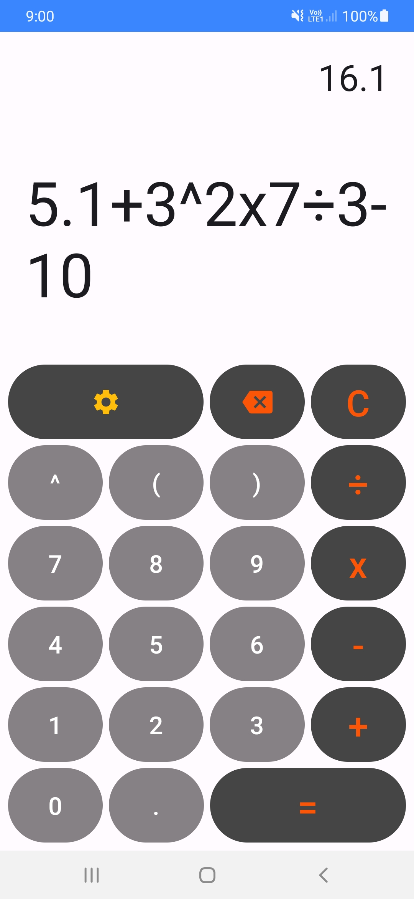

# Android Calculator

## Features
- Built using Kotlin with Jetpack Compose
- MVVM architecture
- Used `MutableDataLive` in ViewModel to observe from the MainActivity to display a `Toast` message

## Screenshot

